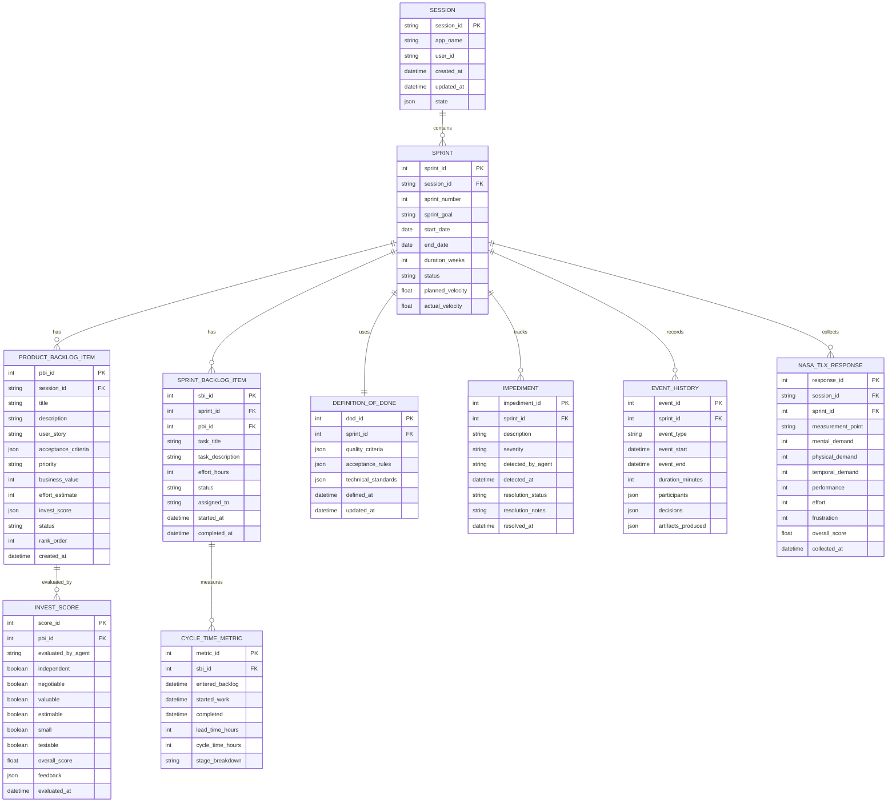

# Multi-Agent System Architecture
## Autonomous Agile Management Platform

This document defines the complete architecture for the TCC project implementing a multi-agent system that simulates Scrum roles.

---

## 0. Current Implementation Status

### What Exists Now (Prototype Phase)

As of October 2025, the codebase is in an **early prototype phase** with a limited, exploratory implementation. This section documents the actual, as-built system that exists today.

#### Current Architecture Diagram


#### Two Workflow Patterns Currently Implemented

**1. Interactive Session-Based Workflow** (`main.py`)
- **User Experience**: Multi-turn conversational interface
- **Control Flow**:
  1. Load or create session (persisted to SQLite)
  2. User enters text
  3. Append text to accumulated `unstructured_requirements`
  4. Call Product Vision Agent with **full accumulated history** (not just latest message)
  5. Parse agent's JSON response (vision statement + is_complete flag + clarifying questions)
  6. Update in-memory session state
  7. Persist state to SQLite
  8. When vision is complete (is_complete=True), switch Runner to Roadmap Agent
  9. Repeat from step 2 with new agent

- **Key Functions**:
  - `load_or_create_session()`: Retrieves existing session or creates new one (user_id="user_123", app_name="ProductManager")
  - `append_user_text_to_requirements()`: Accumulates all user input into single string
  - `run_vision_agent()`: Calls agent with full accumulated requirements
  - `save_state()`: Persists session state to SQLite via DatabaseSessionService
  - `get_session_state()`: Fetches latest state from database

- **State Schema** (in-memory and persisted):
  ```python
  {
      "product_vision_statement": str,      # Agent output
      "product_roadmap": str,               # Agent output (future)
      "unstructured_requirements": str,     # All accumulated user input
      "is_complete": bool,                  # Vision completion flag
      "clarifying_questions": list[str]     # Questions from agent
  }
  ```

**2. Automated Orchestration Workflow** (`product_workflow.py`)
- **User Experience**: Non-interactive, single-pass execution with complete requirements
- **Orchestrator**: `LoopAgent` (Google ADK) as master controller
- **Control Flow**:
  1. Accept fully-formed requirements as input
  2. LoopAgent calls Product Vision Agent with requirements
  3. Checks if vision is complete (is_complete=True)
  4. If incomplete: stops and returns clarifying questions to user
  5. If complete: calls Product Roadmap Agent with vision + original requirements
  6. Returns final roadmap output

- **Key Feature**: Orchestration logic defined via agent instructions (ORCHESTRATOR_INSTRUCTIONS) rather than explicit graph construction

---

#### Agent Responsibilities (Current)

**Product Vision Agent** (`product_vision_agent/`)
- **Input**: Unstructured requirements text
- **Output**: JSON with `product_vision_statement`, `is_complete` bool, `clarifying_questions` list
- **Behavior**:
  - Analyzes requirements and generates a product vision statement
  - If information is missing: creates draft vision with placeholders, asks clarifying questions
  - If information is sufficient: marks vision as complete
- **Configuration**:
  - Uses `InputSchema` and `OutputSchema` from `utils/schemes.py`
  - Instructions loaded from `product_vision_agent/instructions.txt`
  - Disallows transfers to parent/peers

**Product Roadmap Agent** (`product_roadmap_agent/`)
- **Input**: Product vision statement + original user requirements
- **Output**: JSON with `roadmap_draft` (list of RoadmapTheme), `is_complete` bool, `clarifying_questions` list
- **Behavior**:
  - Takes a completed vision and unstructured requirements
  - Generates high-level roadmap organized by themes
  - Each theme includes: name, key features, justification, time frame (Now/Next/Later)
  - Can ask for clarification if roadmap needs more definition
- **Data Structures**:
  ```python
  class RoadmapTheme:
      theme_name: str              # e.g., "User Authentication"
      key_features: List[str]      # Major features under theme
      justification: str           # Why prioritized
      time_frame: str              # "Now", "Next", or "Later"
  ```

---

#### Technology Stack (Current Implementation)

| Layer | Technology | Purpose |
|-------|-----------|---------|
| **Agent Framework** | Google ADK | Agent orchestration, LoopAgent for sequencing |
| **LLM Access** | LiteLLM | Model abstraction layer |
| **LLM Provider** | OpenRouter API | Hosted model access |
| **LLM Model** | gpt-5-nano | Lightweight model for cost efficiency |
| **State Management** | SQLite | Persistent session storage |
| **Session Service** | DatabaseSessionService (ADK) | Session lifecycle management |
| **Schema Validation** | Pydantic | InputSchema/OutputSchema enforcement |
| **I/O Handling** | asyncio + Google ADK streaming | Async agent communication, event streaming |
| **Output Formatting** | Terminal colors (colors.py) | Colored console output |

---

#### Data Flow and State Management (Current)


---

#### Key Implementation Patterns

**1. Multi-Turn Context Accumulation**
```
Turn 1: User input = "Need a task manager"
        Accumulated = "Need a task manager"

Turn 2: User input = "For mobile users"
        Accumulated = "Need a task manager For mobile users"

Turn 3: User input = "With AI prioritization"
        Accumulated = "Need a task manager For mobile users With AI prioritization"
```
The agent receives the FULL accumulated history, not just the latest message. This preserves context across clarifying question exchanges.

**2. Runner Switching Pattern** (Interactive workflow)
```python
# Start with Vision Agent
runner = Runner(agent=product_vision_agent, ...)

# When vision is complete:
if structured.is_complete and runner.agent is not product_roadmap_agent:
    runner = Runner(agent=product_roadmap_agent, ...)  # Switch
```

**3. Schema-Driven Validation**
- Agent outputs MUST be valid JSON matching OutputSchema
- Pydantic validates structure before state update
- Parse failures don't crash the system (error is displayed, user continues)

---

#### Current Limitations and Gaps

| Gap | Why It Matters | Future Solution |
|-----|----------------|-----------------|
| **No Scrum Master Agent** | Cannot facilitate sprint events or detect impediments | Implement SM agent (Phase 3) |
| **No Developer Support Agent** | Cannot break down stories into tasks or track progress | Implement Dev agent (Phase 2) |
| **No Sprint Orchestration** | No state machine for Scrum event flow | State machine + Sprint Facilitator (Phase 3) |
| **No Artifact Persistence** | Vision/Roadmap not linked to formal Product Backlog structure | Implement artifact schemas + INVEST validation (Phase 4) |
| **No Evaluation Framework** | Cannot measure cognitive load or artifact quality | NASA-TLX + INVEST validator agents (Phase 5) |
| **No Multi-Agent Collaboration** | Agents work in series, no peer-to-peer communication | Event bus / Blackboard pattern (Phase 3) |

---

### What Will Be Built (Target Architecture)

The sections below (1-10) describe the **complete target system** as specified in the TCC proposal. The current prototype (Section 0 above) is an early exploration that will evolve into this architecture.

Key differences between current and target:
- **Current**: 2 exploratory agents (Vision, Roadmap)
- **Target**: 8+ specialized agents (PO domain + SM domain + Dev domain)
- **Current**: Simple linear workflows
- **Target**: State machine orchestration with 5 Scrum events
- **Current**: Session-level state management
- **Target**: Full Scrum artifacts (Product Backlog, Sprint Backlog, DoD, Impediments)
- **Current**: No evaluation
- **Target**: NASA-TLX, INVEST, cycle time measurement

---

## 1. High-Level System Architecture


---

## 2. Agent Catalog and Responsibilities


---

## 3. Scrum Event State Machine


---

## 4. Memory and State Architecture


---

## 5. Communication Patterns


---

## 6. Data Schema (Scrum Artifacts)



---

## 7. Agent Interaction Sequence (Sprint Planning Example)


---

## 8. Evaluation Framework Integration


---

## 9. Technology Stack Mapping


---

## 10. Implementation Phases


---

## Next Steps

1. **Review and refine** this architecture with your advisor
2. **Validate** that all TCC requirements are covered
3. **Prioritize** which agents to implement first (suggestion: start with Product Owner domain)
4. **Define** the first sprint's scope for implementation
5. **Begin** with data schema implementation (foundation for everything)

## Questions to Resolve

- [ ] Sprint duration for PoC: 1 week or 2 weeks?
- [ ] Number of test participants for evaluation study?
- [ ] Baseline tool selection (Trello? Jira? GitHub Projects?)
- [ ] LLM model selection (cost vs. capability tradeoff)
- [ ] Human approval checkpoints: synchronous or asynchronous?
