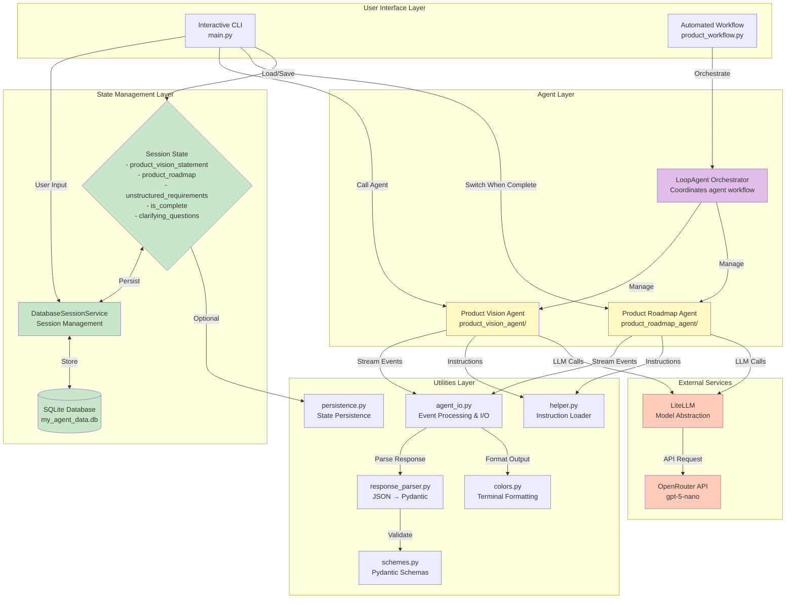
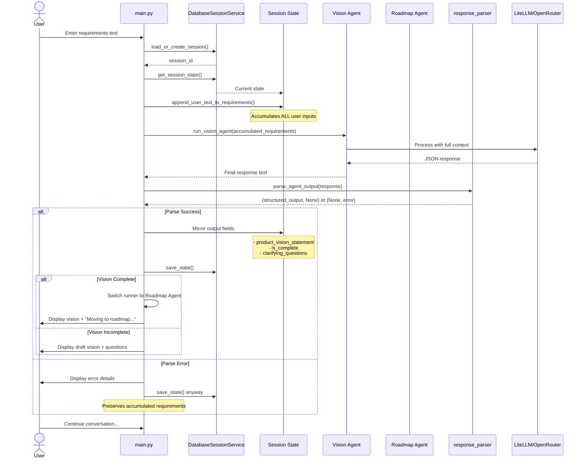
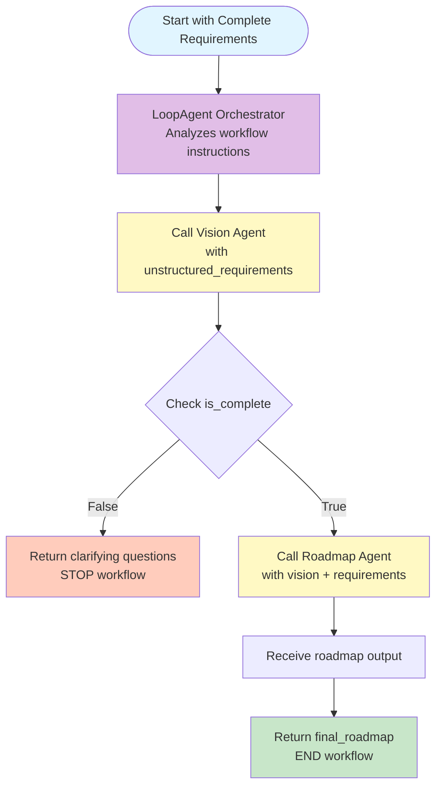
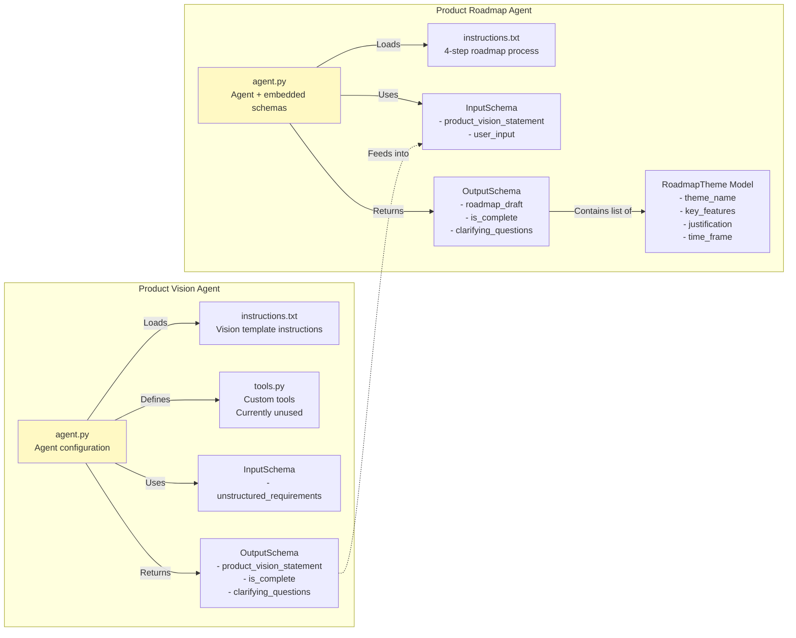
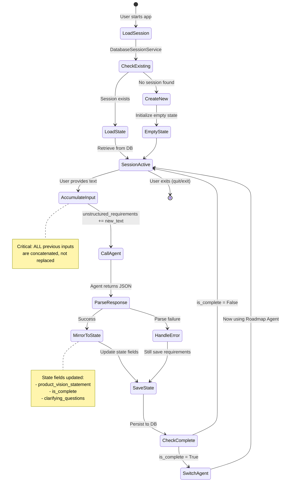
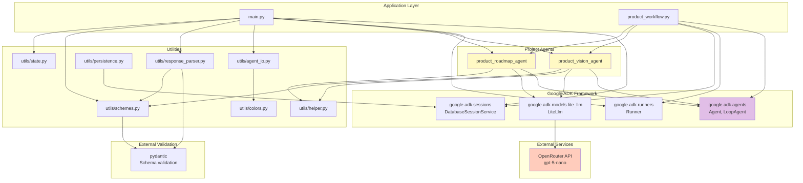

# Current Project Status - Mermaid Diagrams

## System Architecture Overview

## Interactive Workflow (main.py)

## Automated Workflow (product_workflow.py)

## Agent Architecture Details

## State Management Flow

## Dependencies Graph

## File Structure

```mermaid
graph TD
    ROOT[project_tcc/]

    ROOT --> MAIN[main.py<br/>275 lines<br/>Interactive workflow]
    ROOT --> WORKFLOW[product_workflow.py<br/>170 lines<br/>Automated orchestration]
    ROOT --> DB[(my_agent_data.db<br/>SQLite database)]
    ROOT --> ENV[.env<br/>OPEN_ROUTER_API_KEY]
    ROOT --> PYPROJECT[pyproject.toml<br/>Dependencies]

    ROOT --> PV_DIR[product_vision_agent/]
    PV_DIR --> PV_AGENT[agent.py]
    PV_DIR --> PV_INST[instructions.txt]
    PV_DIR --> PV_TOOLS[tools.py]

    ROOT --> PR_DIR[product_roadmap_agent/]
    PR_DIR --> PR_AGENT[agent.py]
    PR_DIR --> PR_INST[instructions.txt]

    ROOT --> UTILS[utils/]
    UTILS --> U_AGENTIO[agent_io.py<br/>135 lines<br/>Event processing]
    UTILS --> U_PARSER[response_parser.py<br/>50 lines<br/>JSON parsing]
    UTILS --> U_SCHEMES[schemes.py<br/>60 lines<br/>Pydantic schemas]
    UTILS --> U_PERSIST[persistence.py<br/>42 lines<br/>State persistence]
    UTILS --> U_STATE[state.py<br/>34 lines<br/>State display]
    UTILS --> U_COLORS[colors.py<br/>32 lines<br/>ANSI colors]
    UTILS --> U_HELPER[helper.py<br/>10 lines<br/>Instruction loader]

    ROOT --> NOTEBOOKS[notebooks/<br/>Jupyter notebooks]

    style MAIN fill:#e1f5ff
    style WORKFLOW fill:#e1f5ff
    style PV_DIR fill:#fff9c4
    style PR_DIR fill:#fff9c4
    style DB fill:#c8e6c9
```

## Key Metrics

| Metric | Value |
|--------|-------|
| **Agents Implemented** | 2 (Vision, Roadmap) |
| **Workflow Patterns** | 2 (Interactive, Automated) |
| **Utility Modules** | 7 modules in utils/ |
| **Total Python Files** | ~15 core files |
| **State Fields** | 5 tracked fields |
| **Database Tables** | 4 (sessions, events, app_states, user_states) |
| **Main Entry Point Lines** | 275 (main.py) |
| **LLM Model** | openrouter/openai/gpt-5-nano |
| **Session Persistence** | SQLite via Google ADK |
| **Agent Transfer Restrictions** | Disabled (no autonomous transfers) |

## Legend

- 🟡 **Yellow** - Agent components
- 🟣 **Purple** - Orchestration layer
- 🟢 **Green** - State/Database layer
- 🟠 **Orange** - External services
- 🔵 **Blue** - User interface layer
